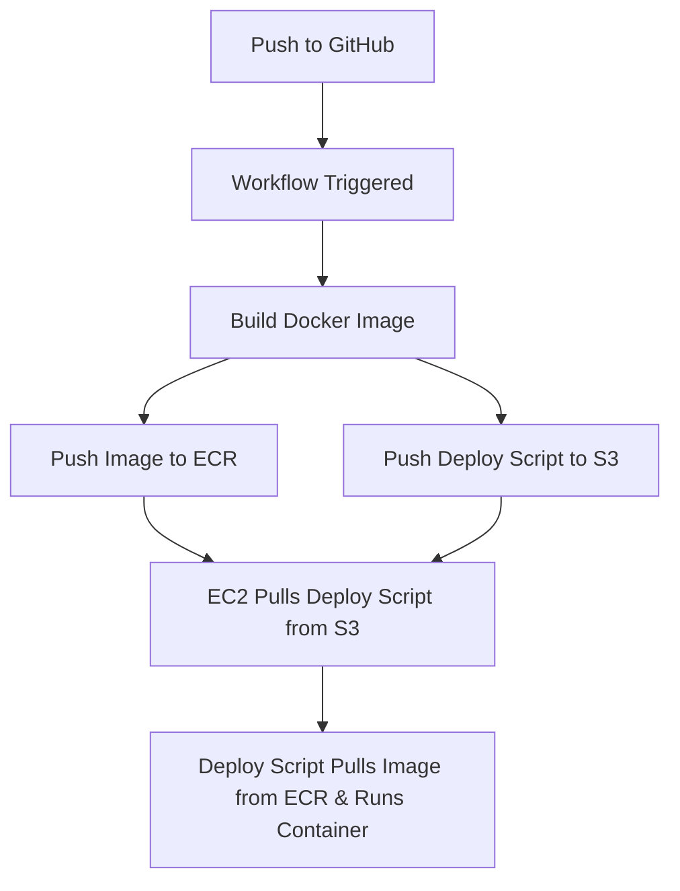

# Practicing ec2 and ecr AWS Resources

## Overview
Immutable Artifact CI/CD pipeline 

Pipeline that builds Docker images on a Github push and deploys
them to an AWS EC2 insance via GitHub Actions, using OIDC for
secure keyless authentication and access to AWS

## Architecture

## Workflow
1. Build Phase (GitHub Actions - Build Job)
	- Checks out code to runner
	- Assumes an AWS role via OIDC (github-actions-build role)
	- Logs into ECR
	- Builds Docker image (Alpine:latest)
	- Tags with ECR registry + repo name + GitHub SHA
	- Pushes to ECR

2. Deploy Phase (GitHub Actions - Deploy Job)
	- Waits for Build job completion
	- Assumes an AWS role via OIDC (github-actions-deploy role)
	- Uploads deploy.sh to S3 Bucket
	- Sends SSM commands to EC2 Instance
		- pulls deploy.sh from S3 Bucket
		- gives executable permissions to script and runs it

3. Helper Scripts
	- deploy.sh
		- Accepts image tag as argument
		- Fetches AWS account ID from SSM Parameter Store
		- Logs into ECR
		- Stops all running containers
		- Launches new container with last image
		- Prunes images older than 24 hours

	- ssm-send-command.sh
		- Accepts arbitrary commands as arguments
		- Formats them as JSON string array (SSM requirement)
		- Executes aws ssm:send-command with proper formatted paremeters

## Key Decisions
1. GitHub Actions
	- Free and native GitHub integration
	- easy to follow YAML config
	- easier to setup, pickup, and learn than Jenkins

2. OIDC Federation
	- No long-lived credentials
	- Limited scope and very intentional permissions

3. IAM Roles - not users
	- IAM users now considered legacy
	- No hardcoded credentials
	- Assumable and no secret rotations

4. ECR (not dockerhub)
	- Private registry with IAM integration
	- no rate limits and faster on AWS

5. S3 Bucket for deploy.sh
	- Easily accesable by EC2
	- Central versioned storage
	- frees up deployment logic from CI

6. Separate deploy.sh script
	- deployment logic easy to update without rebulding whole image

7. ssm-send-command wrapper script
	- SSM:send-command needs JSON string Array and quickly becomes unreadable
	- wrapper accepts normal commands to significantly improve readability
	- used in Deploy job in workflow

## Prerequisites
  - ECR Repository
  - S3 bucket
  - EC2 Instance with SSM Capability
  - IAM roles:
	- github-actions-build (ECR push permissions)
	- github-actions-deploy (S3 upload, SSM:send-command permissions)
  - OIDC provider configured in AWS for GitHub

## Limitations
  - EC2 instance setup manually (single point of failure)
  - No auto-scaling or load balancing
  - No automated rollback on failure
  - No blue/green or canary deployments

## Future Improvements
  - Terraform for EC2/infrastructure provisioning
  - Auto-scaling group with a Golden image AMI
  - Rollback mechanism
  - Notifications on Slack/email on deployment status
